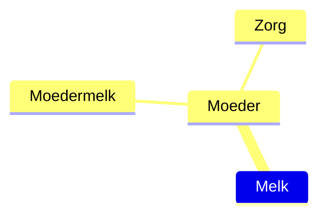
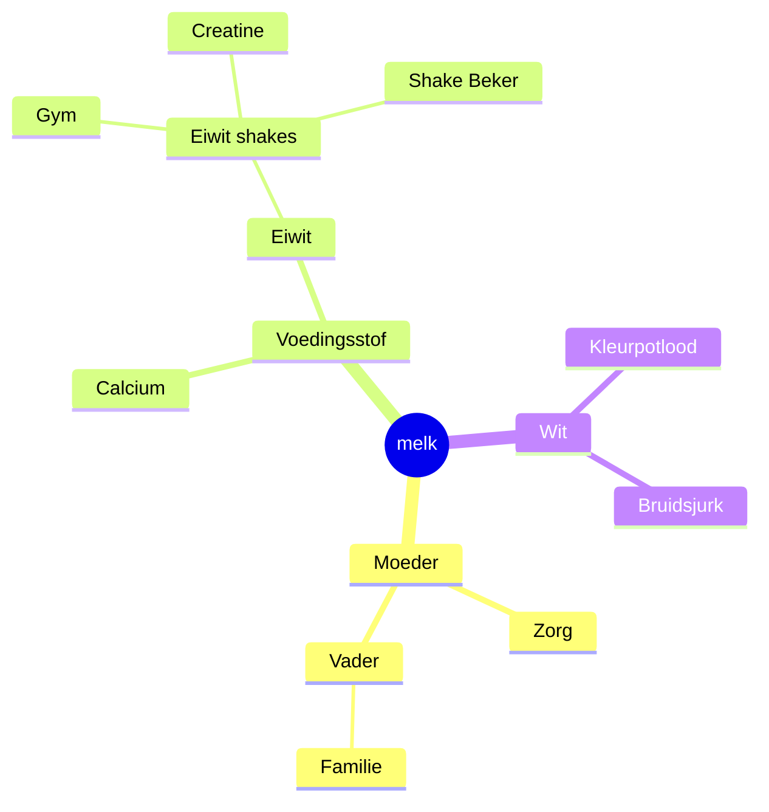

Hi, mijn naam is Randy Ofosu.

Graag wil ik je welkom heten op mijn blog. Wat je hier vindt zijn dingen die mij ooit hebben geboeid. Hier vind je ook alle lessen die ik ooit heb opgedaan en (deels) heb uitgewerkt. Mijn interesses zijn breed, maar zijn vaak IT-gerelateerd. 

---
## Wat doen al die hashtags?
Deze hele website bestaat uit notities die ik maak in mijn notitieblok. \
Dit is allemaal mogelijk met een combinatie van html/css, Obsidian, Quartz (zelf gebruik ik versie 4.2.3) en een beetje liefde. Deze notities zijn aan elkaar gekoppeld net als hoe jij met jouw brein ook werkt met #connecties. 

>[!info]- Simpele uitleg over hoe connecties werken.
>Een praktische voorbeeld is dat #melk een connectie heeft met #moeder, omdat we allemaal in het algemeen grootgebracht zijn met #moedermelk. Dus heeft dat weer een connectie met de #zorg die ieders moeder(figuur) uitdraagt om ons groot te brengen. 

De connecties die wij maken hebben biologische gevolgen. Want hoe meer (en sterker de) connecties ons brein heeft, hoe groter de grijze massa. Deze worden dan weergegeven als constellaties in de #grafiekweergave .

> *Deze hele blog is slechts poging tot een digitale manifestatie van mijn eigen grijze massa.*

---

> [!faq] Oké, maar hoe kan ik mij navigeren?

Deze website wordt ***groot*** dus hier een aantal tips voor het navigeren ervan:

1. Klik op [[home |🏡Home]] als je wilt weten waar ik ***nu*** mee bezig ben.
2. Klik op [[over |🙋🏿‍♂️Over mij]] als je meer over mij wilt weten.
3. Klik op deze [[/tags |🌌Root]] als je op de index van de website wil komen. 
4. De #grafiekweergave helpt je ook navigeren.
5. De zoekbalk werkt echt goed. Vooral voor mobiele gebruikers, geloof me.
---
> [!faq] Hoe kom ik het snelst met jou in contact?
> Over het algemeen reageer ik best snel.
> >Je krijgt mij het snelst te pakken op mijn emailadres:<a href="https://linkedin.com/in/randyofosu" target="_blank">LinkedIn</a>. 
---

> [!info] Mijn socials

<a href="https://linkedin.com/in/randyofosu" target="_blank"><button class="socials-button">LinkedIn</button></a>
<a href="https://instagram.com/randysemicolon" target="_blank"><button class="socials-button">Instagram</button></a>
<a href="https://github.com/randyofosu" target="_blank"><button class="socials-button">Github</button></a>
<a href="https://youtube.com/@randysemicolon" target="_blank"><button class="socials-button">YouTube</button></a>

> [!tip]- 
> Op [bento](https://bento.me/randysemicolon) krijg je een mooi en transparantere overzicht van mijn socials. 

---
### Tot slot

Veel browse plezier en wees niet verlegen.mindmap
